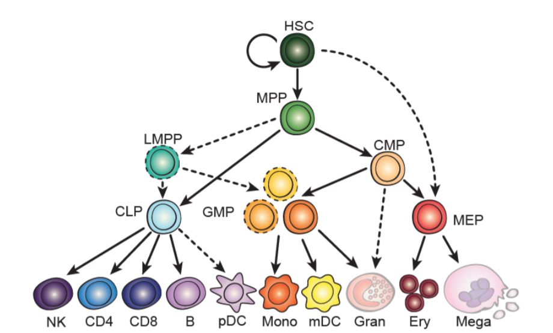

```{r setup, include=FALSE}
knitr::opts_chunk$set(echo = TRUE, fig.align = 'center')
```

In this post, I describe the annotations we will use for LD-score regression. A subset of which are used in torus and statistical fine-mapping.

## General annotations

* Repressed, conserved, and coding regions.
BED files obtained from UCSC. These are common annotations to test general enrichment patterns, i.e. negative enrichment in repressed regions.

* Cancer drivers
327 driver genes $\pm$ 100 kb. Obtained from driverMAPs output at 10% FDR.

* Cancer Open-chromatin regions (OCRs)
These are open-chromatin regions obtained from Corces et al. It is derived from TCGA ATAC-seq data, which made bed files for all 23 cancer types.

* Cancer driver OCRs
Open chromatin regions surrounding the 327 driver genes. Resulting OCRs were expanded $\pm$ 1kb. 

* Cancer H3k27ac
ChIP-seq peak calls, expanded 1kb in both directions
These data were obtained from several data sources:
Breast cancer - MFC7 cell line - ENCODE
Prostate cancer - LNCaP cell line - ChIP Atlas
Melanoma - CHL1 cell line - ChIP Atlas

## Immune Annotations

* Open-chromatin regions (peak calls) across 18 immune cell types from ATAC-seq data. 

Regions were expanded by 500 bases in both directions. Abbreviation of mature cell types is given below.

**Mono**, monocyte; **ery**, erythroid; **mega**, megakaryocyte; **CD4**, CD4+ Tcell; **CD8**, CD8+ T cell; **B**, B cell; **NK**, natural killer cell; **mDC**, myeloid dendritic cell; **pDC**, plasmacytoid dendritic cell

<center>
{width=50%}
</center>


* Immune h3k27ac

ChIP-seq peak calls were obtained from BLUEPRINT epigenome for CD4 Tcells, CD8 Tcells, Macrophages, naive Bcell, natural killer cell, dendritic cells, and monocytes.


